<div align="center">
  <h1>🏢 Информационная система для управляющей компании</h1>
  <p><strong>Курсовая работа по дисциплине «Проектный практикум»</strong></p>
  
  [](https://github.com/alexey0bashkin/housing-management-system)
  [](https://rsuh.ru)
  [](LICENSE)
  [](https://github.com/alexey0bashkin)
  
  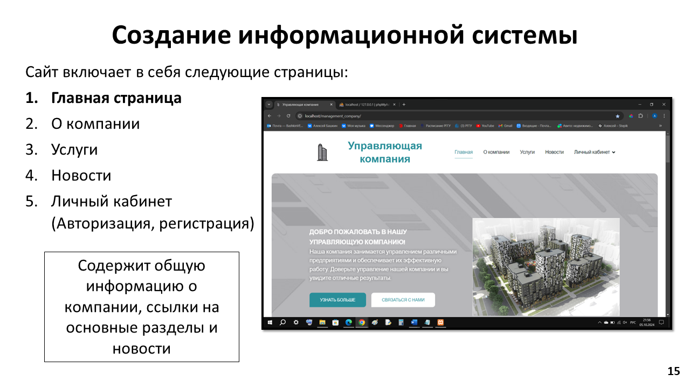
</div>

---

## 📋 О проекте

**Разработка информационной системы для управляющей компании** — это курсовая работа, выполненная в рамках дисциплины «Проектный практикум» на 4 курсе РГГУ.

Система предназначена для автоматизации ключевых процессов управления многоквартирными домами, включая:

- 📊 Учет объектов недвижимости
- 💰 Расчет и начисление коммунальных платежей
- 🔧 Обработка заявок на ремонт и обслуживание
- 👥 Взаимодействие с жильцами через личный кабинет
- 📈 Генерация отчетности и аналитика

---

## 🎯 Цель работы

Создание информационной системы, которая будет способствовать улучшению и упрощению процессов управления объектами недвижимости, учета заявок на ремонт и контроля коммунальных платежей.

---

## 📚 Структура работы

| Глава | Содержание |
|-------|------------|
| **Глава 1** | Анализ предметной области, описание подходов к проектированию ИС, определение требований, обзор технологий и аналогов |
| **Глава 2** | Изучение и выбор инструментов CASE, проектирование БД на инфологическом и даталогическом уровнях, создание модели TO-BE |
| **Глава 3** | Разработка информационной системы: написание кода, создание интерфейса, интеграция с БД |

---

## 🛠️ Технологический стек

<div align="center">
  
  
  
  
  
</div>

### Выбранные технологии

| Компонент | Технология | Обоснование |
|-----------|------------|-------------|
| **СУБД** | MySQL | Производительность, масштабируемость, безопасность |
| **Платформа** | WordPress | Гибкость, большое количество плагинов, удобство настройки |
| **Язык запросов** | SQL | Стандарт для реляционных БД, поддержка сложных запросов |

---

## 📊 Моделирование бизнес-процессов

### Модель AS-IS (как есть)

<div align="center">
  <table>
    <tr>
      <td align="center">
        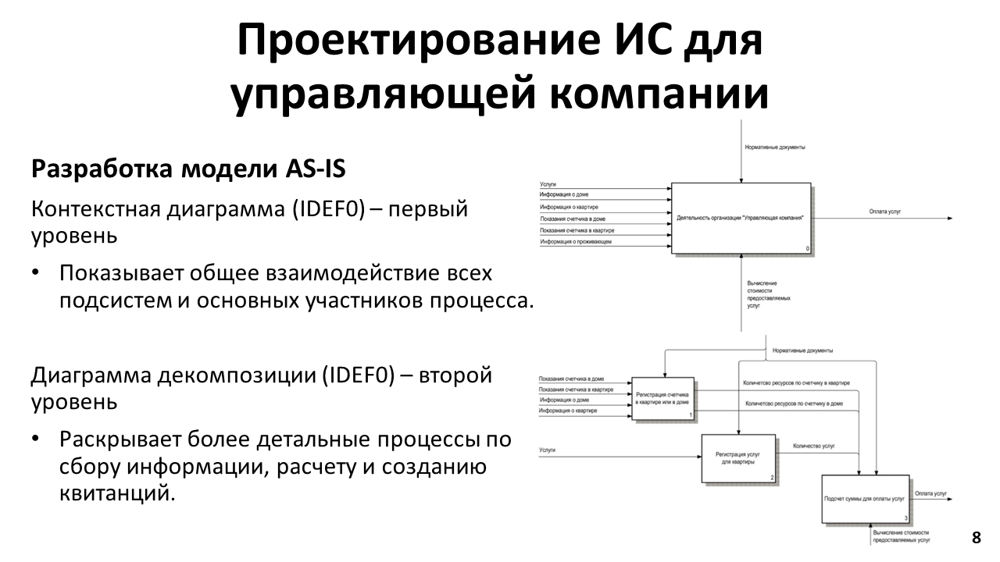
        <p><em>Контекстная диаграмма (IDEF0) — первый уровень</em></p>
      </td>
      <td align="center">
        
        <p><em>Диаграмма декомпозиции (IDEF0) — второй уровень</em></p>
      </td>
    </tr>
  </table>
</div>

### Модель TO-BE (как должно быть)

<div align="center">
  <table>
    <tr>
      <td align="center">
        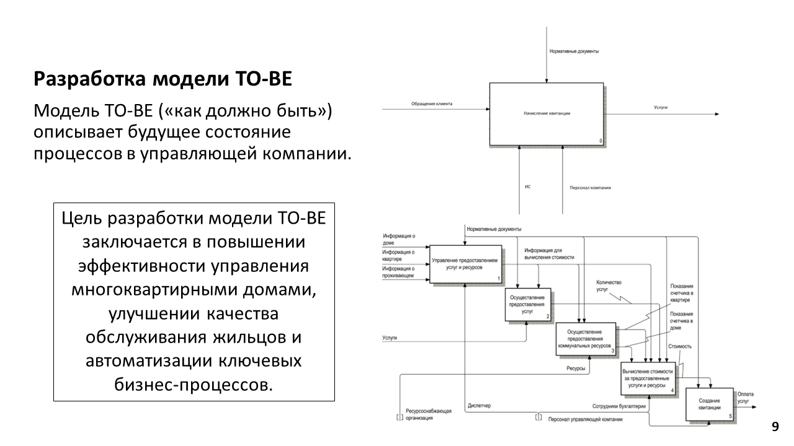
        <p><em>Модель TO-BE</em></p>
      </td>
      <td align="center">
        
        <p><em>Декомпозиция процессов TO-BE</em></p>
      </td>
    </tr>
  </table>
</div>

---

## 🗄️ База данных

### Инфологическая модель

<div align="center">
  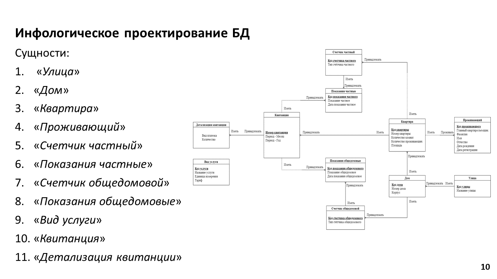
</div>

### Основные сущности

| Сущность | Описание |
|----------|----------|
| `Streets` | Улицы города |
| `Houses` | Многоквартирные дома |
| `Apartments` | Квартиры |
| `Residents` | Проживающие/владельцы |
| `PrivateMeters` | Индивидуальные счетчики |
| `CommonMeters` | Общедомовые счетчики |
| `Services` | Виды коммунальных услуг |
| `Invoices` | Квитанции на оплату |
| `InvoiceDetails` | Детализация квитанций |

### UML-диаграммы

<div align="center">
  <table>
    <tr>
      <td align="center">
        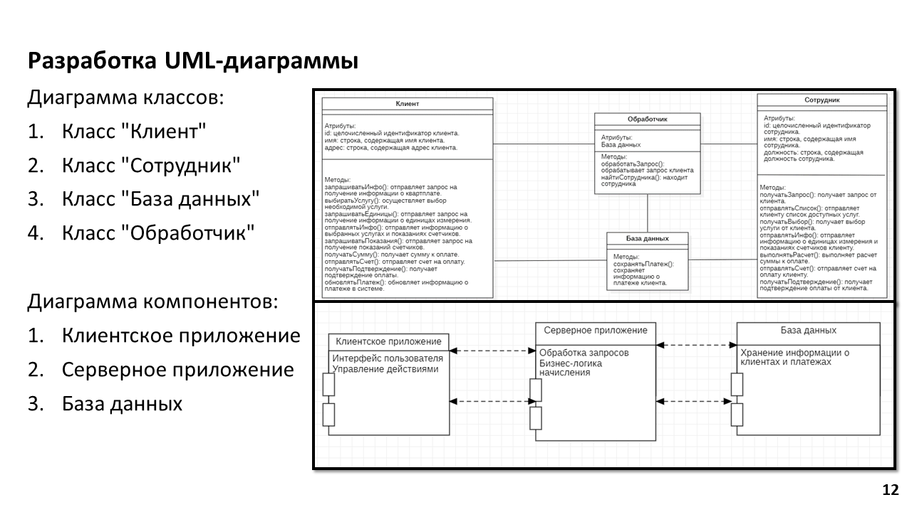
        <p><em>Диаграмма классов</em></p>
      </td>
      <td align="center">
        
        <p><em>Диаграмма последовательности</em></p>
      </td>
    </tr>
    <tr>
      <td align="center">
        
        <p><em>Диаграмма компонентов</em></p>
      </td>
      <td align="center">
        
        <p><em>Диаграмма состояний</em></p>
      </td>
    </tr>
  </table>
</div>

---

## 💻 Функциональность системы

### Основные разделы сайта

<div align="center">
  <table>
    <tr>
      <td width="25%" align="center">
        
        <p><strong>Главная</strong></p>
      </td>
      <td width="25%" align="center">
        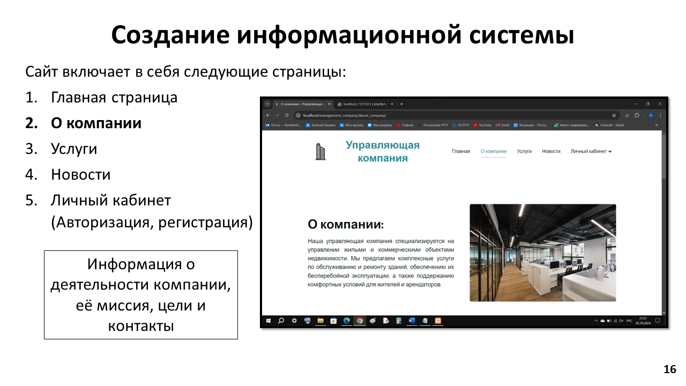
        <p><strong>О компании</strong></p>
      </td>
      <td width="25%" align="center">
        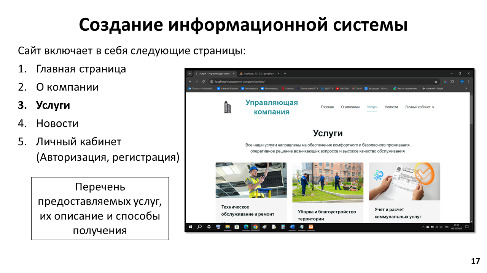
        <p><strong>Услуги</strong></p>
      </td>
      <td width="25%" align="center">
        
        <p><strong>Новости</strong></p>
      </td>
    </tr>
  </table>
</div>

### Личный кабинет жильца

<div align="center">
  <table>
    <tr>
      <td width="33%" align="center">
        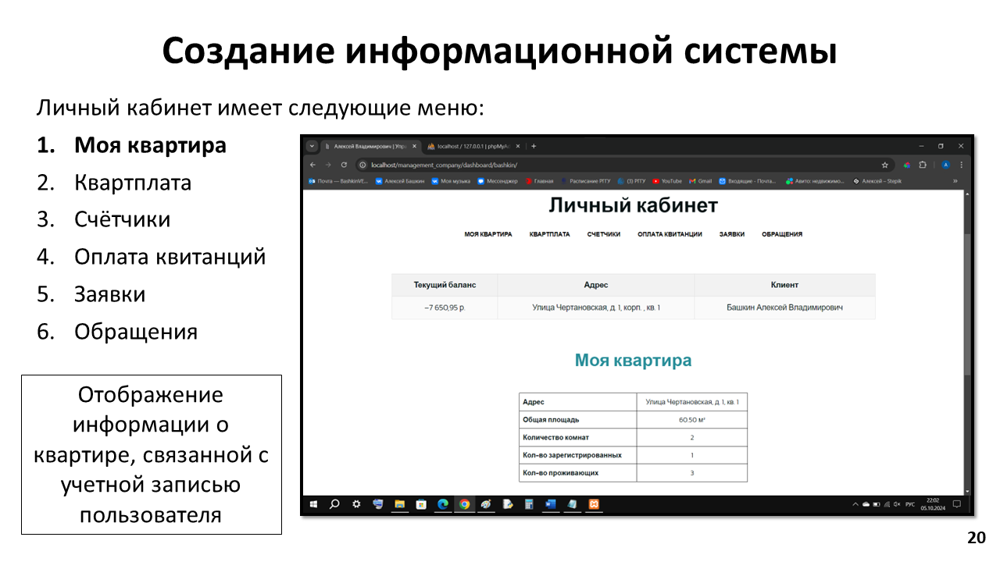
        <p><strong>Моя квартира</strong></p>
      </td>
      <td width="33%" align="center">
        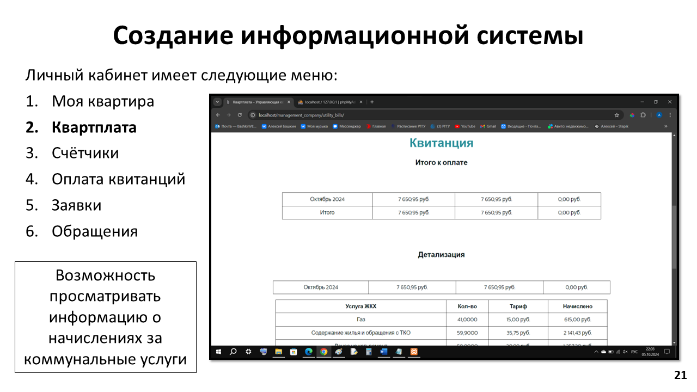
        <p><strong>Квартплата</strong></p>
      </td>
      <td width="33%" align="center">
        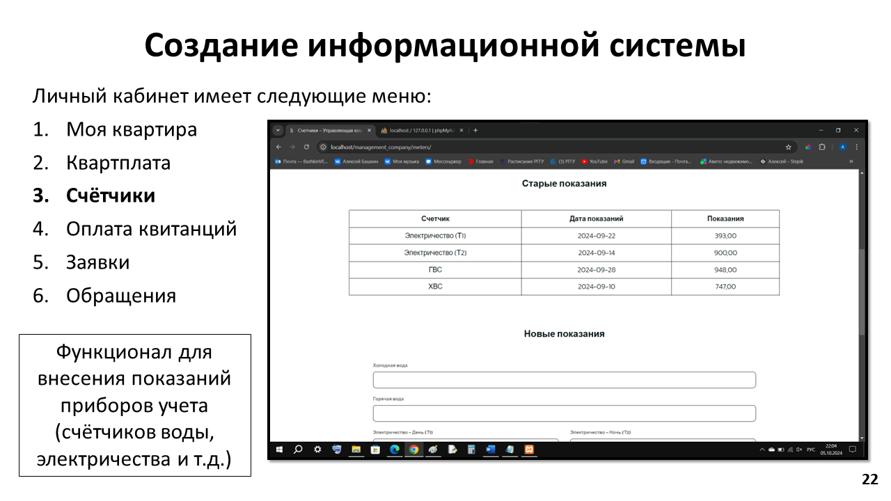
        <p><strong>Счётчики</strong></p>
      </td>
    </tr>
    <tr>
      <td width="33%" align="center">
        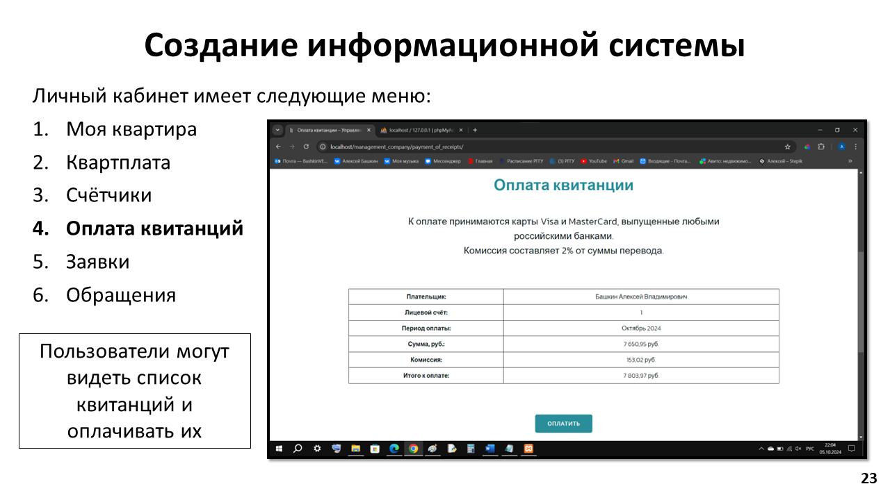
        <p><strong>Оплата квитанций</strong></p>
      </td>
      <td width="33%" align="center">
        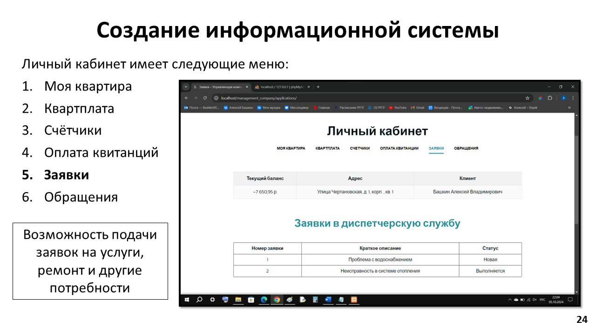
        <p><strong>Заявки</strong></p>
      </td>
      <td width="33%" align="center">
        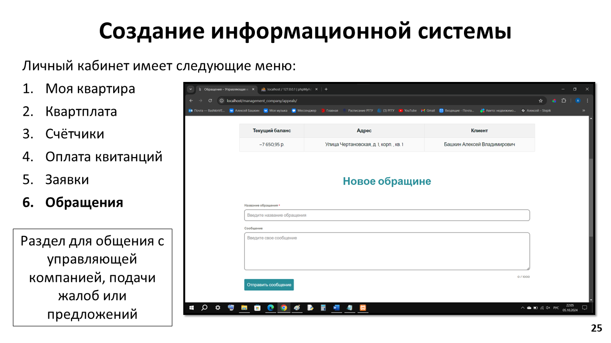
        <p><strong>Обращения</strong></p>
      </td>
    </tr>
  </table>
</div>

---

## 📋 Техническое задание (кратко)

### Функциональные требования

1. **Регистрация пользователя**: регистрация жильцов и сотрудников
2. **Подача заявок**: онлайн-формы для ремонта и обслуживания
3. **Оплата услуг**: интеграция с платежными системами
4. **Личный кабинет**: история заявок, оплат, редактирование профиля
5. **Панель администратора**: управление заявками, создание отчетов

### Требования к безопасности

- Шифрование данных при передаче
- Защита от SQL-инъекций
- Резервное копирование данных

---

## 🗺️ Перспективы развития

- [ ] Интеграция с системами поставщиков коммунальных ресурсов
- [ ] Внедрение мобильного приложения для жильцов
- [ ] Использование интеллектуальных счетчиков (IoT)
- [ ] Модуль аналитики и прогнозирования
- [ ] Система уведомлений (SMS, email, push)
- [ ] Система лояльности для жильцов

---

## 📂 Структура репозитория
housing-management-system/
├── README.md # Описание проекта
├── docs/ # Документация
│ ├── course_work.docx # Полный текст работы
│ ├── presentation.pptx # Презентация
│ └── screenshots/ # Скриншоты
├── database/ # База данных
│ ├── schema.sql # Схема БД
│ └── er_diagram.png # ER-диаграмма
├── wordpress/ # PHP-код для WordPress
└── diagrams/ # Все диаграммы


---

## 🔧 Установка и запуск

```bash
# Клонировать репозиторий
git clone https://github.com/alexey0bashkin/housing-management-system.git

# Импорт базы данных
mysql -u root -p < database/schema.sql

# Настройка WordPress
# 1. Установите WordPress
# 2. Скопируйте PHP-файлы из папки wordpress/ в тему
# 3. Настройте подключение к БД в wp-config.php
